# CML Three Tier Campus Network

## Overview

My goal for this lab was to design a campus three tier architecture and configure the devices to simulate a production network while reinforcing configuration skills and important concepts. I used the Personal version of Cisco Modeling Labs for this lab to allow for a larger topology.

## Objectives

- Design a Three Tier Campus LAN
- Configure Multi Area OSPF
- Establish remote connectivity for SecureCRT management
- Implement Dual ISP connectivity, making edge routers ASBRs
- Implement IP addressing for point to point links and DHCP services for end users
- Configure RSTP and influence the STP topology per building
- Ensure redundancy throughout each layer of the topology
- Configure a FHRP for gateway redundancy at the distribution layer
- Implement port security and best access layer practices for user facing ports
- Configure 802.1Q trunks and VLANs
- Create L2 and L3 EtherChannels
- Configure NTP with the edge routers acting as NTP masters

## Topology

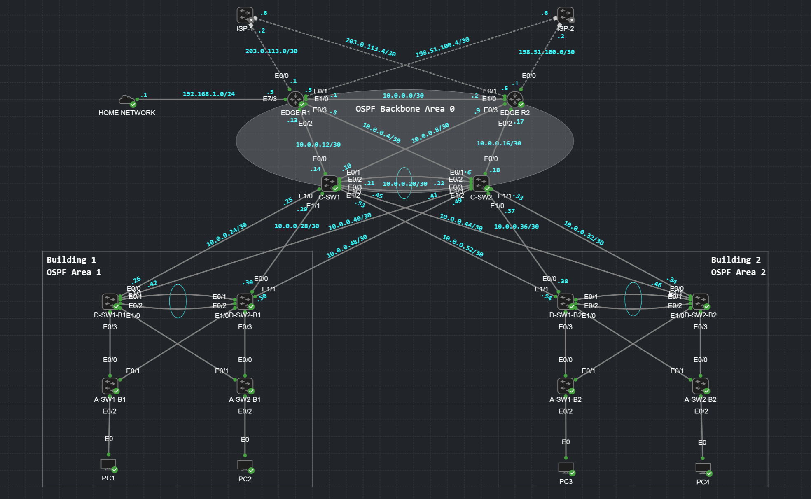

## Design Considerations

This lab features many design considerations and deviations due to lab scope and resource constraints. 

**Three Tier Model**

This lab focuses on the Three Tier hierarchical model of core, distribution, and access. All core switch and edge router connections are point to point links with /30 masks. Using L3 connections keeps VLANs, STP, and broadcasts confined to the distribution and access layers, simulating a real production network for a campus LAN.

**Dual ISP Connectivity**

The edge routers in the topology have redundant connections to ISP 1 and ISP 2. E R1 has ISP 1 as the primary path and E R2 has ISP 2 as its primary path, while the other ISP acts as failover on both edge routers. Both are advertising their default routes into OSPF using `default-information originate`, which makes them Autonomous System Boundary Routers (ASBRs). ASBRs allow routes from other protocols to be included in OSPF.

> **Note:** The ISPs are represented by L2 Switches in this lab that have no configuration.

**OSPF Areas**

This lab topology includes two buildings, each its own OSPF area. This makes the core layer switches, C-SW1 and C-SW2, Area Border Routers (ABRs). The OSPF backbone area 0 includes the edge routers and core switches. 

## Design Deviations

As stated, this lab focuses on a three tier architecture including core, distribution, and access. In real world implementations, designs may deviate from this textbook model, creating collapsed two tier or even single tier models depending on the size of the network, general purpose, or cost constraints.

In this lab, due to simplicity and resource considerations, I chose to deviate from a few things I would implement in a real environment, such as various types of servers, firewalls, wireless access points, wireless LAN controllers, and other types of networking and end user devices. CML also doesn't support IP phones, which are commonly seen in real production networks. 

## Initial Configuration

All routers and switches within the topology have a standard baseline configuration that includes a hostname, domain name, RSA key generation for SSH, logging synchronous for VTY and console lines, disabled exec timeouts, and local logins for authentication. OSPF has been configured to allow connectivity throughout the entire topology, with Building 1 in OSPF area 1 and Building 2 in OSPF area 2.

All devices are managed remotely via SecureCRT. Layer 3 devices are managed through their loopback interfaces, and access layer switches are managed from their management SVIs.

## VTP and VLAN Configuration

VLAN Trunking Protocol (VTP) allows for VLAN database synchronization between switches in a VTP domain. In this lab I used VTP version 3, and each building has its own VTP domain since VTP doesn't traverse L3 connections. All configurations are identical, and SW1 of each building is the primary.

**D-SW1-B1 VTP Configuration:**

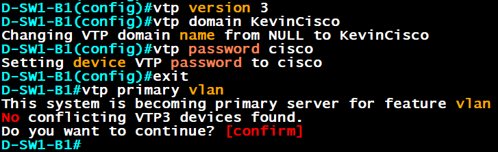

With VTP version 3, you can set a switch as the primary server for the domain. This prevents unauthorized changes and accidental or malicious VLAN database overwrites. All switches in the VTP domain need the same domain name and password. If the primary server goes offline or loses connection, no VLAN database changes can be made.

The downside of VTP version 3 is that anytime the switch is rebooted, it must be manually reconfigured as primary using the command `vtp primary vlan`, otherwise no VLAN changes can be made from any switch.

### VLAN Table

**Building 1**

| VLAN | Subnet |
|---|---|
| 10 | 10.10.1.0/24 |
| 20 | 10.20.1.0/24 |
| 30 | 10.30.1.0/24 |
| 40 | 10.40.1.0/24 |
| 99 | 10.99.1.0/24 |

**Building 2**

| VLAN | Subnet |
|---|---|
| 10 | 10.10.2.0/24 |
| 20 | 10.20.2.0/24 |
| 30 | 10.30.2.0/24 |
| 40 | 10.40.2.0/24 |
| 99 | 10.99.2.0/24 |

VRRP for each VLAN SVI uses `.1`, and D SW1 and D SW2 use `.2` respectively.

**SVI OSPF Configuration:**

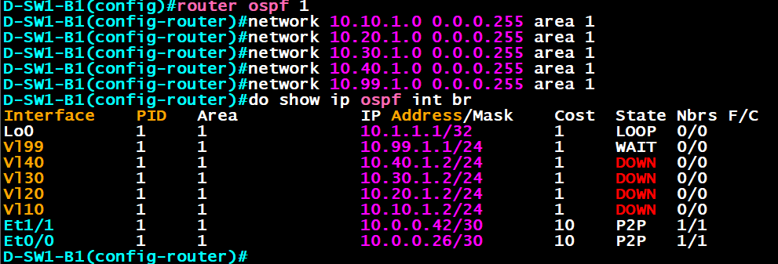

VLANs 20, 30, and 40 show a DOWN state because their SVIs are down. VLAN 99's SVI is up because I used the `no autostate` command to bring it up without any ports assigned to it.

## VRRP Configuration on SVIs

Virtual Router Redundancy Protocol (VRRP) is a First Hop Redundancy Protocol (FHRP) that is open standard and best suited for multi vendor environments. VRRP allows clients in the buildings to have redundant default gateways so they can reach the rest of the network or send traffic to the ISP. VRRP is placed at the distribution layer in each building.

**D-SW1-B1 VRRP Configuration:**

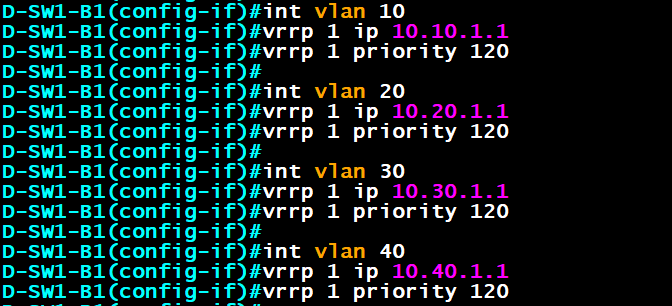

All primary switches have a higher VRRP priority. If the primary switches go offline, the secondary distribution switches take over, and once the primary distribution switches come back online they preempt the master status by default with VRRP, unlike HSRP.

**VRRP Addition on Distribution Switches:**

To remotely access the access layer switches via their VLAN 99 management SVIs, I needed to assign them a default gateway, so for additional redundancy I added VRRP for VLAN 99 on all distribution switches. Now if either distribution switch goes offline, the access layer switches can still be reached remotely since a path still exists.

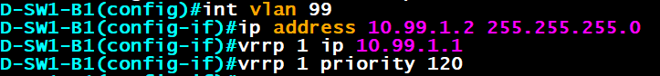

## Rapid Spanning Tree Configuration

Spanning tree prevents loops at L2, sometimes called broadcast storms, which can take down a network in seconds. Broadcast storms occur when broadcast messages continuously loop, and unlike L3 packets, there is no Time To Live field for L2 frames. Cisco's version of STP is called Per VLAN Spanning Tree (PVST+).

**D-SW1-B1 Rapid PVST+ Configuration:**

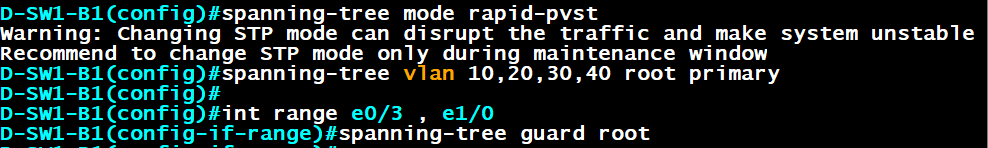

D SW1 for both buildings is configured as the root bridge for each VLAN and is also the VRRP master in this lab. Although traffic could be load balanced by having separate root bridges for different VLANs, I didn't believe it was necessary in this environment since the buildings don't have a lot of devices or traffic.

Root guard was configured on ports connecting to access layer switches to prevent a new switch with lower BPDUs from overwriting the current root bridge.

**D-SW2-B1 Rapid PVST+ Configuration:**

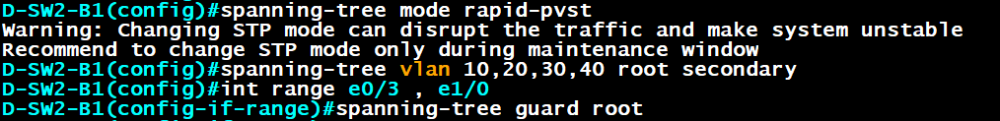

D SW1 and D SW2 in Building 2 are configured identically.

## NTP Configuration

Network Time Protocol (NTP) allows devices to synchronize their time to an NTP server, which connects to lower stratum servers in a hierarchy, eventually reaching an atomic clock that provides time for stratum 1 servers. Stratum numbers identify how accurate a time source is, with lower numbers being more accurate.

**E-R1 NTP Configuration:**

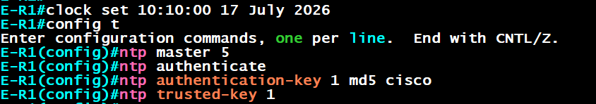

E R1 and E R2 are both configured as NTP masters. The core switches use them as their NTP servers, the distribution switches use the core, and the access layer switches use the distribution switches as their NTP servers. This creates an NTP hierarchy within the network.

**NTP Issue:** I noticed that NTP wouldn't sync between Edge R1 and C SW1, even though they are directly connected. After some research I learned that this is a common issue with Cisco IOL (IOS on Linux) devices having trouble synchronizing time, even with matching configurations. Because of this issue, I removed all NTP authentication, but I kept it in this documentation to show what would be used in a production network.

**New NTP Configuration on E-R1:**

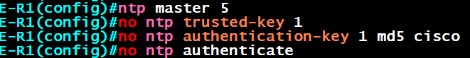

**NTP Issue #2:** Even after removing NTP authentication, the devices still won't synchronize time with the edge routers. In a production network it's critical that devices are synchronized and displaying the correct time. Because of this, I left it configured, but device times are not fully synchronized in this lab.

## DHCP Configuration

Dynamic Host Configuration Protocol (DHCP) allows the clients in each building to receive an IP address from their respective pools. Using the VLAN table above, I created the DHCP pools on Edge R1, which functions as this network's DHCP server. In a real production network you would likely see many redundant servers throughout the network providing DHCP rather than a single router, which would create a single point of failure. Depending on the number of users within a network, a router also shouldn't function as the primary DHCP server in a real environment.

**E-R1 DHCP Pool Exclusions:**

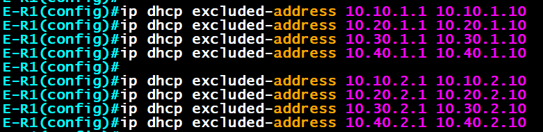

I excluded addresses `.1` through `.10` for each VLAN's subnet to prevent address conflicts and leave additional room for extra static IP addresses if needed.

**E-R1 Building 1 DHCP Pools:**

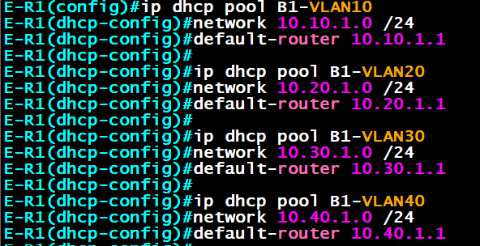

**E-R1 Building 2 DHCP Pools:**

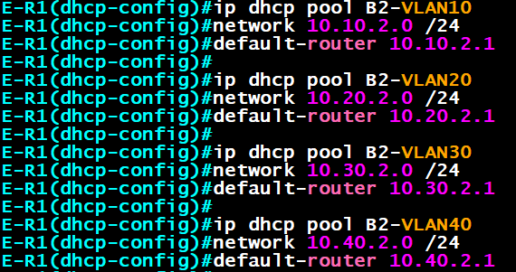

Distribution switches were configured with `ip helper-address 1.1.1.1` on their VLAN SVIs, pointing to E R1 as the DHCP server for this lab.

**PC4 DHCP Lease in VLAN 40:**

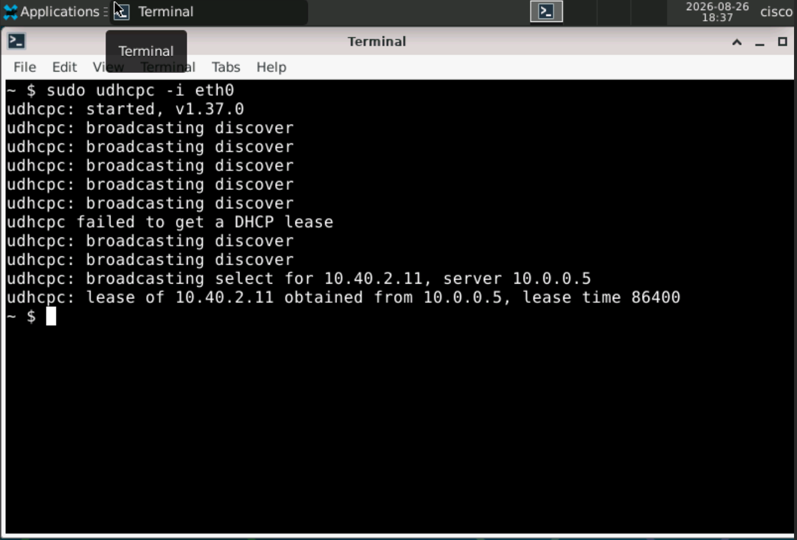

Each PC received the `.11` address, which is the first usable address within each VLAN's DHCP pool.

**E-R1 DHCP Binding Table:**

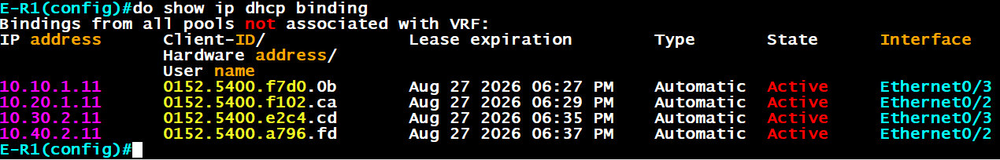

## Portfast and BPDU Guard Configuration

Access switches within a production network should be secured with port security options and security best practices. Earlier I made all unused ports into access ports, placed them into an unused VLAN, and disabled them entirely.

Now I am enabling PortFast and BPDU Guard on the used access ports. PortFast allows a switchport to transition to forwarding state faster so clients can send and receive packets without delay. BPDU Guard prevents these ports from accepting BPDUs (Bridge Protocol Data Units) to prevent network loops if a switch is connected.

**A-SW1-B2 PortFast and BPDU Guard Configuration:**

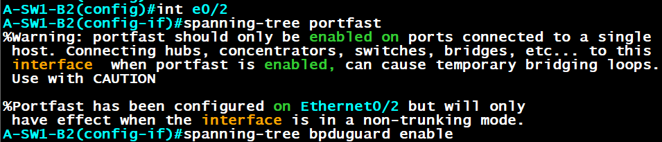

All ports on access switches leading to clients are configured with PortFast and BPDU Guard.

## Port Security Configuration

Port security prevents additional MAC addresses from being learned on a switchport. This prevents MAC table flooding attacks, spoofing, and unauthorized physical access.

For this lab, the violation setting is set to restrict, which drops the traffic and logs the violation but does not place the port into an err disabled state. I also set the maximum learned MAC addresses to one and set them to sticky so they are saved in the running configuration.

**Issue:** I noticed distribution and access switches in Building 2 were experiencing instabilities such as slowly established remote connections, higher CPU usage, delayed commands, frequent disconnects, and session timeouts. Investigating the connecting interfaces, I noticed an alarming amount of input and output packets, broadcasts, errors, and unknown protocol drops.

**A-SW2-B2 Output of `show interfaces ethernet 0/0`:**

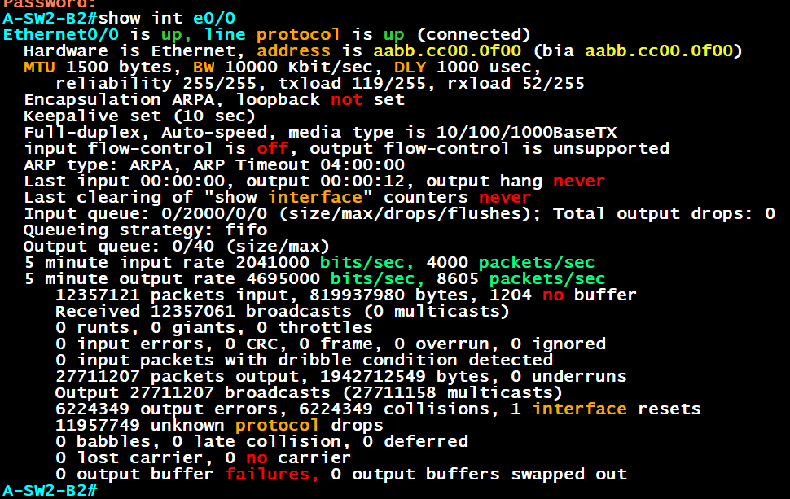

Given the sheer number of broadcasts and packets input and output, I suspected a STP broadcast storm, so I verified all STP states using `show spanning-tree` and `show spanning-tree summary`, but all ports were in the correct states. Once port states were verified, I no longer suspected an STP loop as the cause.

An interesting part of the `e0/0` interface output above was the amount of unknown protocol drops. After researching, I determined that on some versions of IOS, when a switch receives 802.1Q tagged frames for VLANs not configured on the port, it doesn't know what to do and flags the frames as an unknown protocol, flooding the frame instead of dropping it. This explained the broadcasts. Rather than an STP loop, a broadcast storm was still being created, causing connection issues, instability, high CPU usage, and delayed commands since the switches continuously sent broadcasts to each other.

To fix this issue, I double checked interface statuses on switches in Building 2 and found that D SW2 B2 was missing trunk configurations to switches A SW1 B2 and A SW2 B2.

Regarding the large number of collisions and output errors, this is due to false collision reports within CML using IOS on Linux devices, even when using full duplex. Processing frames during the broadcast storm was pushed to extreme rates, which also increased these counters.

**A-SW1-B1 Port Security Configuration:**

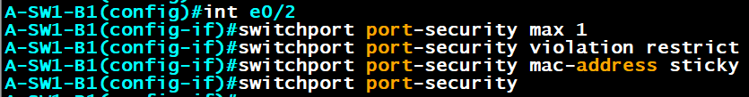

All other access switches receive the same configuration.

## DHCP Snooping Configuration

DHCP snooping prevents unauthorized devices from acting as a rogue DHCP server and handing out incorrect IP address information to clients. Switchports are configured as trusted or untrusted. DHCP snooping is configured on all access switches.

**A-SW1-B1 DHCP Snooping Configuration:**

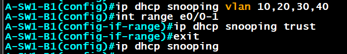

E0/0 and E0/1 are trunks leading to the distribution switches on all access switches. Since DHCP comes from E R1, the connections leading to it need to be trusted. Because the trunks carry VLANs 10, 20, 30, and 40, DHCP snooping needs to be enabled for those VLANs.

## Dynamic ARP Inspection Configuration

Dynamic ARP Inspection (DAI) is a Layer 2 security feature that inspects and validates Address Resolution Protocol (ARP) packets before they are forwarded, preventing ARP spoofing or poisoning attacks. DAI uses the DHCP snooping binding table to validate the IP to MAC address mapping on untrusted ports.

**A-SW2-B1 DAI Configuration:**

The ports going to the distribution switches are made trusted. The ports facing end users on access switches remain untrusted.

The `ip arp inspection validate dst-mac ip src-mac` command enables validation of the IP, source MAC, and destination MAC addresses within ARP packets simultaneously, increasing security.
